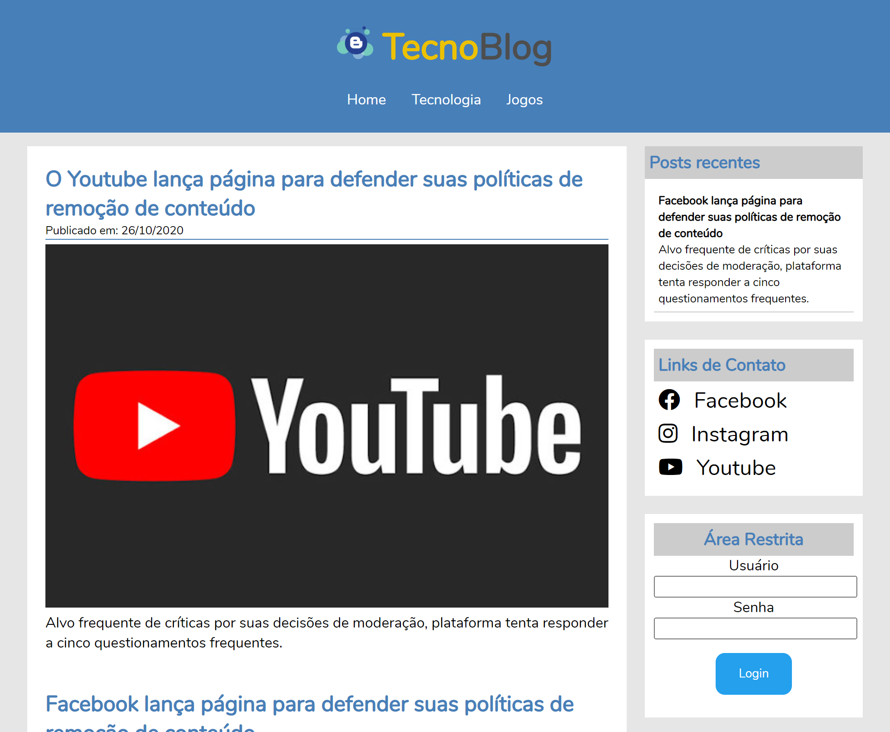
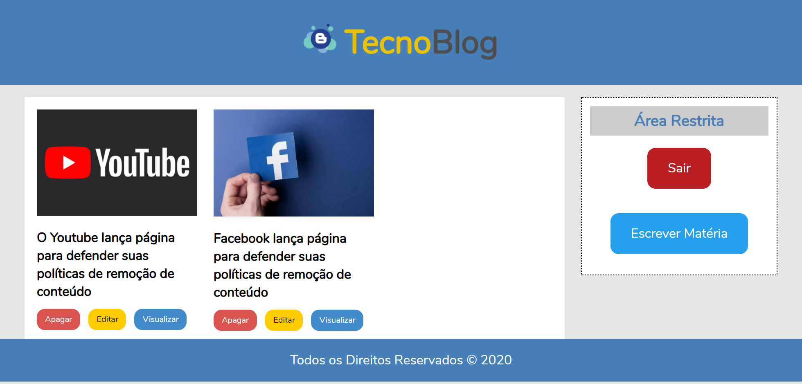
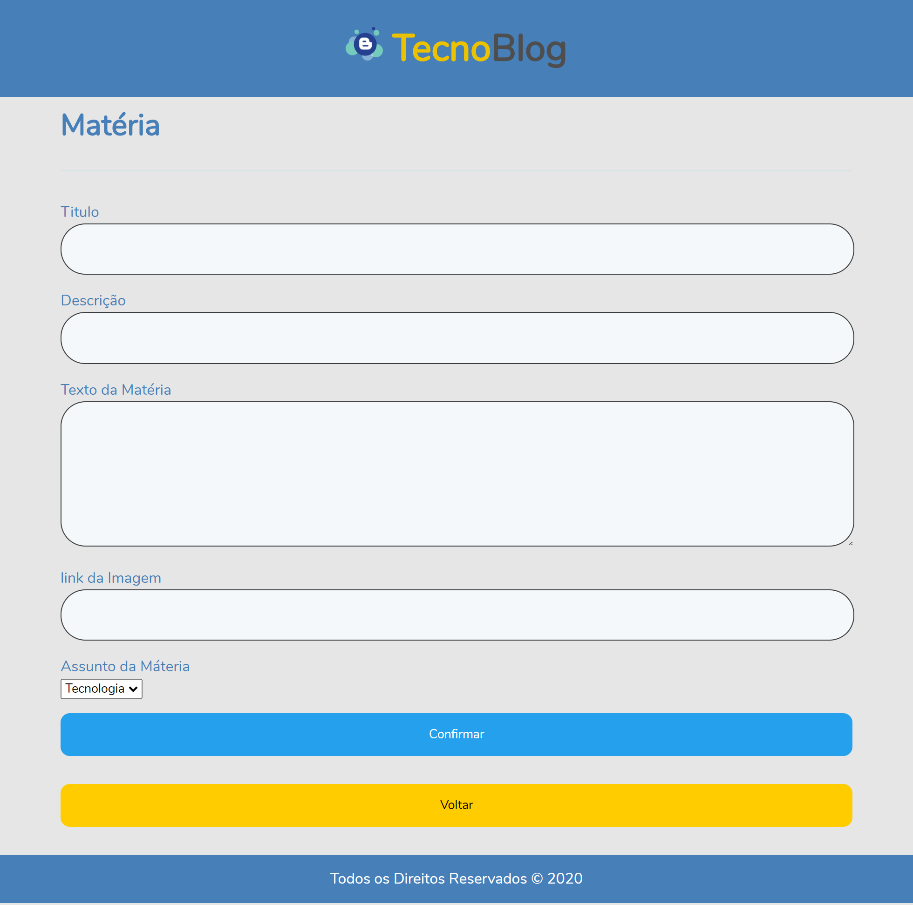

<h1 align="center">
    
</h1>

## 🚀 Objetivo
Esse projeto consiste em um blog de tecnologia que permite escrever, editar, remover e visualizar materias do blog.
É utilizado HTML, JavaScript e CSS para consumir a API [TecnoBlog-Back-End](https://github.com/aldotheapache1/TecnoBlog-Back-End)

##Index

  

##Área Restrita

  

##Visualizar Matéria

  

##Escrever Matéria

  

